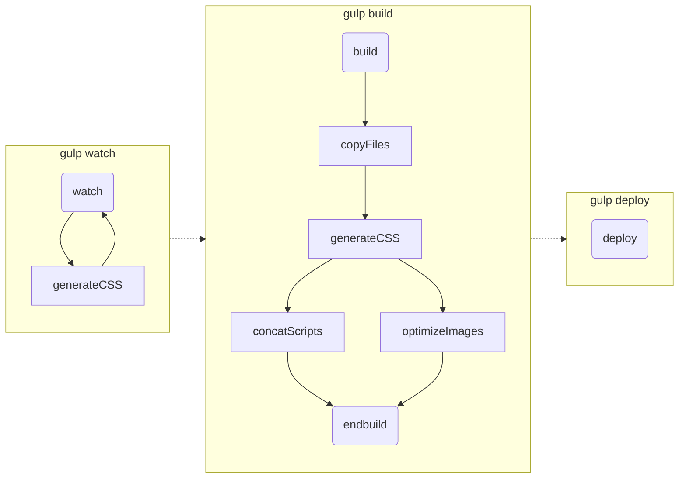
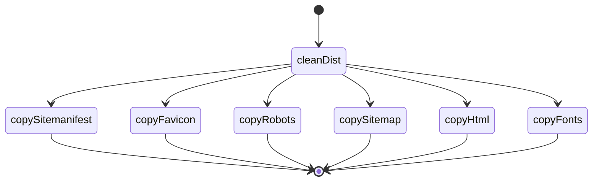
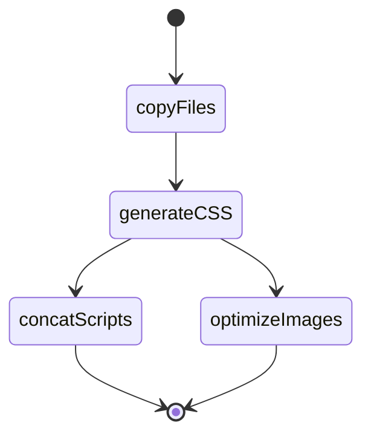

# WebDev Environment VSCode mit Gulp

Dieses Repository stellt eine Entwicklungsumgebung zur Webentwicklung für VSCode mit gulp bereit. Es werden verschiedene gulp-Tasks zur Verfügung gestellt, welche die Webentwicklung und das Deployment vereinfachen.

## Inhaltsverzeichnis

- [WebDev Environment VSCode mit Gulp](#webdev-environment-vscode-mit-gulp)
  - [Inhaltsverzeichnis](#inhaltsverzeichnis)
  - [1. Voraussetzungen](#1-voraussetzungen)
    - [Windows: Skripte erlauben](#windows-skripte-erlauben)
  - [2. Installation](#2-installation)
    - [2.1 Installation unter Linux](#21-installation-unter-linux)
  - [3. Einrichtung der WebDev Umgebung](#3-einrichtung-der-webdev-umgebung)
    - [3.1 Dateipfade für Projektdateien](#31-dateipfade-für-projektdateien)
    - [3.2 Deployment Parameter](#32-deployment-parameter)
  - [4. Gulp-Tasks](#4-gulp-tasks)
    - [4.1 gulp watch](#41-gulp-watch)
    - [4.2 gulp copyFiles](#42-gulp-copyfiles)
    - [4.3 gulp generateCSS](#43-gulp-generatecss)
    - [4.4 gulp concatScripts](#44-gulp-concatscripts)
    - [4.5 gulp optimizeImages](#45-gulp-optimizeimages)
    - [4.6 gulp build](#46-gulp-build)
    - [4.7 gulp deploy](#47-gulp-deploy)

## 1. Voraussetzungen

Um dieses Repository nutzen zu können ist mindestens `NodeJS` erforderlich. Empfohlen wird zusätzlich `git` und `VSCode`.

1. [NodeJS](https://nodejs.org) - Hier sollte die aktuelle LTS Version installiert werden.
2. [git](https://git-scm.com/) - Hier kann die aktuellste Version installiert werden.
3. [VSCode](https://code.visualstudio.com/download) - Hier kann ebenfalls die aktuellste Version installiert werden.

Nach der Installation sollten einige Konfigurationseinstellungen getroffen werden.

Mittels Terminal kann der Nutzername, Nutzeremail und Default-Branchname für `git` global festgelegt werden:

```shell
git config --global user.name "<Vorname Nachname>"
git config --global user.email "<Email-Adresse>"
git config --global init.defaultBranch main
```

Wenn ein automatisches Deployment genutzt werden soll, ist das Vorhandensein von entweder `rsync` oder `ssh` mit `scp` im Suchpfad notwendig. Diese sind bei Bedarf nach zu installieren.

[Zum Anfang](#inhaltsverzeichnis)

### Windows: Skripte erlauben

Wird `gulp` unter Windows installiert, wird beim ausführen eine Fehlermeldung erscheinen, weil Windows das Ausführen von Skripten per se verhindert. Um das Ausführen von Skripten für den aktuellen Nutzer dennoch zu erlauben muss eine PowerShell-Konsole als Administrator geöffnet werden und folgender Befehl ausgeführt werden:

```ps
Set-ExecutionPolicy -ExecutionPolicy RemoteSigned -Scope CurrentUser
```

[Zum Anfang](#inhaltsverzeichnis)

## 2. Installation

Zur Installation muss eine Ordnerstruktur angelegt, die im Paket enthaltenen Dateien an die richtigen Stellen kopiert, die `NodeJS` Module heruntergeladen und ein `git`-Repo initialisiert werden. Zu diesem Zweck stehen Installationsskripte bereit. Alle Schritte können jedoch auch per Hand durchgeführt werden.

Der Ordner `./src` muss in das Wurzelverzeichnis des Projektes kopiert werden. Anschliessend sollte folgende Ordnestruktur vorhanden sein:

```bash
|- app/
   | - images/
   | - js/
   | - scss/
   | - index.html
|- gulpfile.js/
|- node_modules/
|- secret/
|- package.json
|- package-lock.json
|- .gitignore
|- .vscode
|- .browserslistrc
```

Sind die Dateien entpackt, müssen die benötigten `NodeJS`-Module für das Projekt installiert werden:

```shell
npm install
```

Zum Schluss wird noch das `git`-Repo für das Projektverzeichnis initialisiert:

```shell
git init
```

Die WebDev Umgebung ist nun lauffähig und kann genutzt werden.

[Zum Anfang](#inhaltsverzeichnis)

### 2.1 Installation unter Linux

Dieses Paket verfügt über ein Installationsskript für Linux.
Das Paket wird in das Wurzelverzeichnis des Projektes entpackt und anschliessend kann das Installationsskript aus diesem Verzeichnis heraus gestartet werden.

```shell
chmod u+x && ./install.sh
```

## 3. Einrichtung der WebDev Umgebung

Die Nutzung dieser Umgebung sieht vor, dass das WebProjekt / die WebApp im Ordner `./app/` entwickelt wird. Bevor die App dann auf einen Server deployed wird, wird sie mittels eines Build-Prozesses für das Web optimiert und steht dann im Ordner `./dist/` bereit. Anschliessend kann der `./dist/`-Ordner auf einen Server mittels rsync oder scp deployed werden.

### 3.1 Dateipfade für Projektdateien

Die WebDev Umgebung setzt eine bestimmte Ordnerstruktur voraus, mit der die gulp-Tasks arbeiten können.

1. `./app/`

   Das ist das Wurzelverzeichnis des Webprojektes. Hier wird normalerweise die index.html abgelegt. Weitere Dateien die hier abzulegen wären sind bspw. robots.txt, website.manifest, alle favicion-Dateien.

2. `./app/js/`

   In diesem Verzeichnis werden alle JavaScript-Dateien gespeichert

3. `./app/scss/`

   Speicherort für alle scss bzw css Files

4. `./app/fonts`

   Hier werden Fonts, die für die Webseite relevant sind, abgelegt

5. `./app/images/`

   Alle zur Webseite gehörenden Bilder

6. `./gulpfile.js/`

   An dieser Stelle befinden sich die einzelnen Dateien in denen die gulp-Tasks definiert werden. Weiterhin ist hier die index.js, welche die gulp-Tasks includiert und exportiert.

7. `./secret/`

   Hier werden Dateien abgelegt, welche zum Entwickeln wichtig sind, aber nicht in ein git-Repo aufgenommen werden sollen. Beispielsweise Key-Files zum deployen oder Parametereinstellungen

[Zum Anfang](#inhaltsverzeichnis)

### 3.2 Deployment Parameter

Um das automatisierte Deployment nutzen zu können sind einige Parameter einzustellen. Dies erfolgt entweder direkt in der entsprechenden Task Datei `./gulpfile.js/deploy.js` in der `function setConfig()` oder in einer separaten Datei `./secret/deployConfig.js`. Ein Beispieldatei `./secret/deplyConfig.js.example` wird mitgeliefert und kann dem Bedarf entsprechend angepasst und anschliessend umbenannt werden.

**Wenn die Einstellungen in `./gulpfile.js/deploy.js` getroffen werden, sind diese Teil des Git-Repositorys und werden ausserdem beim Updaten der WebDev Umgebung zurückgesetzt.**

Folgende Parameter sind zu definieren:

- `deployMethod`:Auswahl aus `scp`, `rsync` oder `auto`. Legt die Methode fest, mit welcher die Dateien auf den Zielserver übertragen werden. Bei `auto` wird versucht die Deploymentmethode herauszufinden und automatisch auszuwählen. Hierbei wird `rsync` präferiert.
- `hostToDeploy`: Adresse des Hosts, auf den deployed werden soll. Kann sowohl ein FQDN als auch eine IP-Adresse sein.
- `portAtHost`: Port auf dem Zielhost, welcher zum Verbindungsaufbau mittels der Deployment-Methode genutzt werden soll.
- `username`: Benutzername der sich am Zielsystem authentifiziert.
- `privateKey`: Pfad zum privaten (SSH-)Schlüssel, der den Nutzer auf dem Zielsystem identifiziert. Der Schlüssel sollte im Verzeichnis `./secret/` des Projektes oder ausserhalb des git-Repositorys liegen, damit dieser nicht Teil des Repositorys wird.
- `localDir`: Lokales Verzeichnis, welches auf das Zielsystem übertragen werden soll. Normalerweise sollte das `./dist/` sein. Der Trailing-Slash sollte hier mit angegeben werden.
- `remoteDir`: Pfad auf dem Zielsystem in den die Dateien übertragen werden sollen. Der Benutzer benötigt Schreibrechte auf den Pfad (siehe `username`). Der Pfad muss zwingend mit einem `/` enden, andernfalls droht Datenverlust
- `testRun`: `true` oder `false`. Bei `true` wird ein Testlauf durchgeführt, ohne dass etwas übertragen oder gelöscht wird.

Das Deployment soll nur über schlüsselbasierte Authentifizierung erfolgen. Hierzu muss der private Schlüssel, der zur Authentifizierung am Zielsystem dienen soll in der Datei `~/.ssh/config` des (lokalen) Nutzers, welcher das Deployment durchführt, definiert werden. In diesem Fall wird der Schlüssel `id_rsa_deployUser` verwendet:

```bash
Host me.example.de
  User deployUser
  IdentityFile ~/.ssh/id_rsa_deployUser
```

Der Nutzer `deployuser` muss auf dem Zielsystem existieren und die Rechte zur Anmeldung via SSH besitzen. In der Datei `/home/deployUser/.ssh/authorized_keys` muss der öffentliche Schlüssel zum Zertifkat `id_rsa_deployUser` vorhanden sein.

Der Nutzer benötigt Schreibrechte auf das Verzeichnis, in welches auf dem Zielsystem deployed werden soll. Dies kann mittels der Nutzung von ACL erfolgen, bspw. mittels:

```bash
setfacl -d -m u::rwX,u:deployUser:rwX,o::- DeployDir
```

[Zum Anfang](#inhaltsverzeichnis)

## 4. Gulp-Tasks

Es werden verschiedene Gulp-Tasks für das Entwickeln, den Building-Prozess und das Deployen der App angeboten:



### 4.1 gulp watch

`gulp watch` startet einen Watcher, welcher die Dateien im `./app/scss` Verzeichnis überwacht. Sobald dort Änderungen auftreten (z.B. wenn eine Datei neu abgespeichert wird), wird diese durch einen SASS Compiler kompiliert, mit Prefixes (webkit) versehen und im Verzeichnis `./app/css/` abgespeichert.

[Zum Anfang](#inhaltsverzeichnis)

### 4.2 gulp copyFiles

`gulp copyFiles` löscht in einem ersten Schritt das `/dist/`-Verzeichnis und kopiert anschliessend Dateien, die nicht weiter bearbeitet werden müssen aus dem `./app/*`-Ordner in den `./dist/`-Ordner:

- Alle Dateien aus dem `./app/fonts/`-Verzeichnis
- Alle Dateien aus dem `./app/html/`-Verzeichnis
- `sitemap.xml` aus dem `/app/`-Verzeichnis
- `robots.txt` aus dem `/app/`-Verzeichnis
- `(png|ico|svg)` aus dem `/app/`-Verzeichnis
- `site.manifest` aus dem `/app/`-Verzeichnis



[Zum Anfang](#inhaltsverzeichnis)

### 4.3 gulp generateCSS

`gulp generateCSS` liest `*.scss`die Dateien in `./app/scss/` ein, kompiliert diese mit einem SASS-Compiler und versieht das Ergebnis anschliessend mit `--webkit`-Prefixen, falls erforderlich. Die Ausgabe der bearbeiteten Datei erfolgt als `*.css`-Datei in `./app/css/`. Dies ist auch der Pfad der im Projekt (bei der Referenzierung in HTML-Dateien) verwendet werden muss, damit der Build-Prozess funktioniert.
Durch Nutzung des SASS-Compilers ist es möglich im Projekt SASS anstelle von CSS zu verwenden. Wird SASS nicht verwendet, müssen die Dateien in `./app/scss/` trotzdem auf `*.scss` enden.

[Zum Anfang](#inhaltsverzeichnis)

### 4.4 gulp concatScripts

`gulp concatScripts` konkateniert CSS- und JavaScript-Dateien. Anschliessend werden diese minifiziert und für das Web optimiert. Dazu ist eine spezielle Referenzierung der Dateien innerhalb der HTML-Dokumente erforderlich:

```html
<!-- build:css css/styles.min.css -->
<link rel="stylesheet" href="css/styles.css" />
...

<!-- endbuild -->
```

Alle Referenzierungen die zwischen den beiden HTML-Kommentaren stehen werden zu einer Datei zusammengefasst. Die resultierende Datei ist `./css/styles.min.css` und die Syntax ist CSS (`build:css`). Der Pfad ist relativ zur Datei, welche die Referenz enthält.

```html
<!-- build:js js/main.min.js -->
<script type="text/javascript" src="js/main.js"></script>
...
<!-- endbuild -->
```

Alle Referenzierung die zwischen den beiden HTML-Kommentaren stehen, werden zu einer Datei zusammengefasst. Die resultierende Datei ist `./js/main.min.js` und die Syntax ist JavaScript (`build:js`). Der Pfad ist relativ zur Datei, welche die Referenz enthält.

Alle Dateien, inklusive der HTML-Datei in der die Referenzierungen deklariert sind, werden in das Verzeichnis `./dist/` geschrieben. Die Referenzierungen in der HTML-Datei werden im `./dist/` Verzeichnis durch die konkatierte Datei ersetzt.

Beispielsweise:

_./app/index.html_:

```html
<!-- build:css css/styles.min.css -->
<link rel="stylesheet" href="css/styles.css" />
<link rel="stylesheet" href="css/styles.mobile.css" />
<link rel="stylesheet" href="css/styles.print.css" />
<!-- endbuild -->
```

wird zu:

_./app/**dist**/index.html_:

```html
<link rel="stylesheet" href="css/styles.min.css" />
```

[Zum Anfang](#inhaltsverzeichnis)

### 4.5 gulp optimizeImages

`gulp optimizeImages` liest alle `(png|jpg|jpeg)`-Bilder aus `./app/images/*` und verkleinert die Auflösung so, dass die längste Seite 1080 Pixel hat. Anschliessend werden die Bilder minifiziert (Speichergröße) und in `./dist/app/images/` gespeichert. Dabei wird die Ausgabe gecached, so dass beim mehrmaligen Aufrufen des Tasks, nur die Bilder modifiziert und neu geschrieben worden, die noch nicht bearbeitet wurden oder sich verändert haben.

[Zum Anfang](#inhaltsverzeichnis)

### 4.6 gulp build

`gulp build` ist eine Pipeline und bedient sich anderer Gulp-Tasks um aus den Dateien im `./app/`-Verzeichnis eine für das Web optimierte Version der WebApp im `./dist/`-Verzeichnis bereit zu stellen. Bei jedem Durchgang von `gulp build` wird ein evtl. vorhandenes `./dist/`-Verzeichnis gelöscht.



[Zum Anfang](#inhaltsverzeichnis)

### 4.7 gulp deploy

`gulp deploy` kopiert eine optimalerweise mittels `gulp build` erzeugte WebApp auf einen anderen Host in ein Zielverzeichnis. Die Konfiguration ist in [3.2 Deployment Parameter](#32-deployment-parameter) erläutert.
Zu beachten ist, das in jedem Fall eine Synchronisation des lokalen Verzeichnisses in das Zielverzeichnis erfolgt, so dass Dateien im Zielverzeichnis auch gelöscht werden können.
